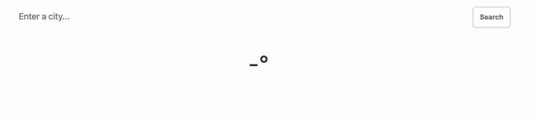
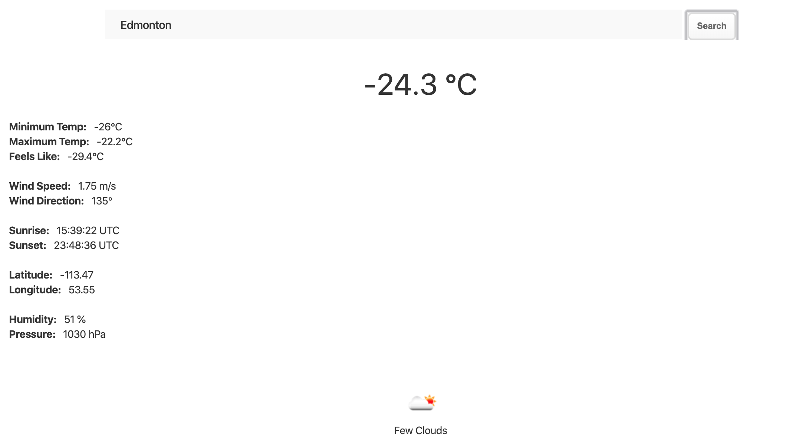

# Weather
A live weather app built using HTML, CSS, Javascript, and [OpenWeatherAPI](https://openweathermap.org/api).

## Searching
This application supports searching for specific city, anywhere in the world. Type the city you would like to search for:

## Data Supported
This application supports the following weather data:
* Current Temperature (°C)
* Minimum Temperature (°C)
* Maximum Temperature (°C)
* "Feels Like" (windchill) Temperature (°C)
* Wind Speed (m/s)
* Wind Direction (°)
* Sunrise Time (UTC)
* Sunset Time (UTC)
* City Latitude
* City Longitude
* Humidity (%)
* Pressure (hPa)
* Weather Description (w/ [icons](https://openweathermap.org/weather-conditions))
    * Clear
    * Cloudy (Few/Scattered/Broken)
    * Overcast
    * Snow (Light, Heavy)
    * Rain (Shower/Regular/Thunderstorm)
    * Mist/Fog
    * Hail

After hitting the **search** button, the weather data should be updated, as shown below:
